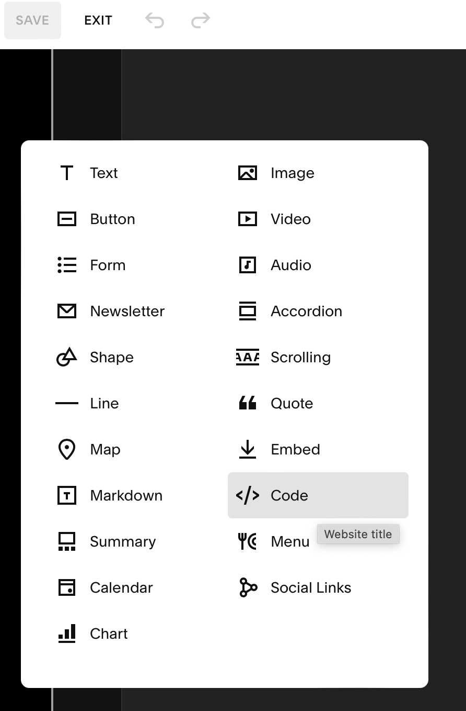

# carceral-groups-website

Example of this app can be found at https://tiger-fiddle-k95c.squarespace.com/mapping-repository

## Setup
1. Start dev container

1. in a terminal `az login`

1. run the following bash to create a service principal (Output used as a Github Repo Secret)
    ```bash
    # <github_act_azstorage_sp> = name to identify this as a storage deployer for github actions
    az ad sp create-for-rbac --name <github_act_azstorage_sp> --sdk-auth --role contributor --scopes /subscriptions/<subscription id>/resourceGroups/<resource group name>
    ```

1. Add two secrets to Github Repo
    1. AZ_STORAGE_DEPLOYER = previous step result
    1. AZ_STORAGE_ACCOUNT_NAME = A Storage account to host your static site.

1. Grab URL of your static site hosted in Azure Storage

1. Make a Sqaurespace site.

1. Add a Code block to your page


1. Add the following HTML code (make edits to src to match your static website url)
    ```html
    <iframe src="<my static website url>" width="100%" height="800px">
      <p>Your browser does not support iframes.</p>
    </iframe>
    ```

## Authentication

- Followed https://learn.microsoft.com/en-us/entra/identity-platform/tutorial-single-page-app-react-register-app

## Useful Links
- [Azure Portal](https://portal.azure.com)
- [MaterialUI React Components](https://mui.com/material-ui/all-components/)
- [LeafletJS used for a map](https://leafletjs.com)
- [React](https://react.dev/learn)
- [Squarespace](https://www.squarespace.com)

## Made With React + TypeScript + Vite

This template provides a minimal setup to get React working in Vite with HMR and some ESLint rules.

Currently, two official plugins are available:

- [@vitejs/plugin-react](https://github.com/vitejs/vite-plugin-react/blob/main/packages/plugin-react/README.md) uses [Babel](https://babeljs.io/) for Fast Refresh
- [@vitejs/plugin-react-swc](https://github.com/vitejs/vite-plugin-react-swc) uses [SWC](https://swc.rs/) for Fast Refresh

## Expanding the ESLint configuration

If you are developing a production application, we recommend updating the configuration to enable type aware lint rules:

- Configure the top-level `parserOptions` property like this:

```js
export default {
  // other rules...
  parserOptions: {
    ecmaVersion: 'latest',
    sourceType: 'module',
    project: ['./tsconfig.json', './tsconfig.node.json'],
    tsconfigRootDir: __dirname,
  },
}
```

- Replace `plugin:@typescript-eslint/recommended` to `plugin:@typescript-eslint/recommended-type-checked` or `plugin:@typescript-eslint/strict-type-checked`
- Optionally add `plugin:@typescript-eslint/stylistic-type-checked`
- Install [eslint-plugin-react](https://github.com/jsx-eslint/eslint-plugin-react) and add `plugin:react/recommended` & `plugin:react/jsx-runtime` to the `extends` list
